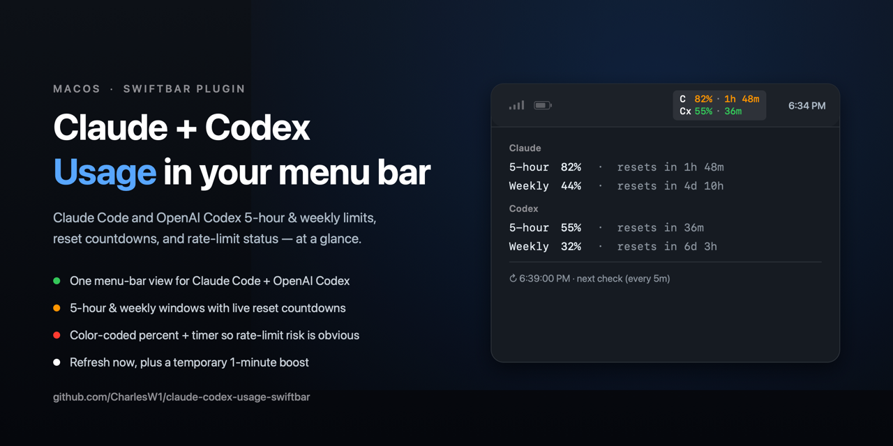
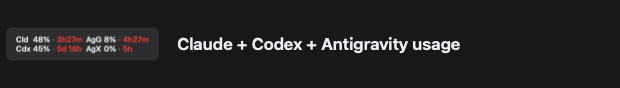
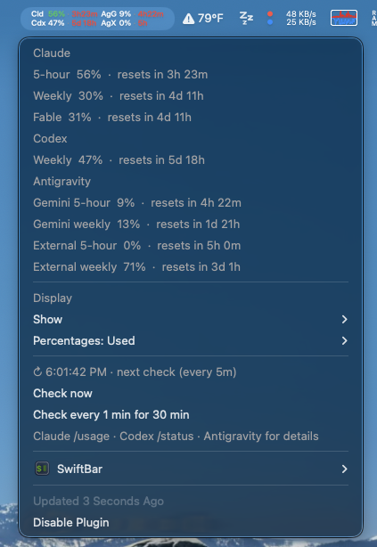

# Claude + Codex + Antigravity Usage SwiftBar

[](https://swiftbar.app/)
[](https://www.python.org/)
[](README.md)
[](LICENSE)



A macOS [SwiftBar](https://swiftbar.app/) / xbar-style menu-bar usage monitor for
**Claude Code**, **OpenAI Codex**, and **Google Antigravity**. It shows 5-hour and weekly usage limits,
reset countdowns, rate-limit status, and per-window detail as color-coded
status-bar lines.





The menu-bar grid shows Claude (`Cld`), Codex (`Cdx`), Antigravity Gemini (`AgG`), and Antigravity External (`AgX`):

```text
Cld 85% · 3h11m  AgG 20% · 4h11m
Cdx 52% · 14m    AgX 10% · 2h
```

Providers are shown as **percent used** (or percent remaining, configurable), so the numbers are directly
comparable.

## What You Get

- One menu-bar view for Claude Code, OpenAI Codex, and Antigravity usage.
- Dropdown checkboxes for showing Claude, Codex, and/or Antigravity.
- 5-hour and weekly limit windows with reset countdowns.
- Color-coded usage and reset timing so rate-limit risk is visible at a glance.
- Dropdown detail for Claude `/usage`, Codex `/status`, and Antigravity windows.
- Manual **Refresh now** plus a temporary 1-minute refresh boost for 30 minutes.
- Local-only token reads from the macOS Keychain and `~/.codex/auth.json`; no
  Python packages required.

## Dependencies

- macOS
- SwiftBar: `brew install --cask swiftbar`
- Xcode Command Line Tools, including `swiftc`: `xcode-select --install`
- Python 3.9 or newer
- No Python packages: `claude_usage.py` uses the Python standard library only
- Claude Code, Codex, and/or Antigravity signed in locally

The plugin still works if only some providers are signed in; the others show an
unavailable state.

## Install

1. Install SwiftBar:

   ```bash
   brew install --cask swiftbar
   ```

2. Install Xcode Command Line Tools if `swiftc` is not available:

   ```bash
   xcode-select --install
   ```

3. Create a dedicated SwiftBar plugin folder that contains **only** the two
   plugin files. Do not point SwiftBar at this git repo, because SwiftBar runs
   every file it finds recursively.

   From this repo:

   ```bash
   mkdir -p ~/swiftbar-plugins/claude-codex-usage
   ln -sf "$PWD/claude-usage.300s.py" ~/swiftbar-plugins/claude-codex-usage/claude-usage.300s.py
   ln -sf "$PWD/claude_usage.py" ~/swiftbar-plugins/claude-codex-usage/claude_usage.py
   ```

4. Launch SwiftBar, open Preferences, and set the plugin folder to:

   ```text
   ~/swiftbar-plugins/claude-codex-usage
   ```

5. Make sure Claude Code and/or Codex are signed in:

   ```bash
   claude
   codex login
   ```

6. In SwiftBar, choose **Refresh All**.

On first run, macOS may ask for Keychain access to `Claude Code-credentials`;
choose **Always Allow**. The first run also compiles the embedded Swift renderer
with `swiftc`, which can take a second or two. Later runs reuse the cached
renderer.

The `.300s.` in `claude-usage.300s.py` tells SwiftBar to run it every 300 seconds
(5 minutes). Rename the file to change the default interval, for example
`claude-usage.60s.py` for 1 minute. Short intervals may hit provider rate
limits, so 5 minutes is the recommended default.

## Usage

By default, the menu-bar item shows a 2x2 grid:

- `Cld`: Claude Code 5-hour usage and reset countdown.
- `Cdx`: Codex primary window usage and reset countdown.
- `AgG`: Antigravity Gemini window.
- `AgX`: Antigravity External window.

Click the item to open the dropdown. It shows:

- Claude 5-hour and weekly windows.
- Codex 5-hour and weekly windows.
- Antigravity Gemini and External 5-hour and weekly windows.
- **Display** options with per-provider **Show** checkboxes. The selected
  options are saved locally in `~/.cache/claude-usage/display_mode`.
- The next scheduled check time.
- **Refresh now**, which asks SwiftBar to rerun the plugin immediately.
- **Refresh every 1 min for 30 min**, which temporarily triggers SwiftBar once a
  minute for 30 minutes. While active, the dropdown shows **Stop 1-minute
  boost**.

## Color Legend

The `Cld`, `Cdx`, `AgG`, and `AgX` tags are always white. Usage percent and reset timer are
colored independently in the menu-bar image:

| Signal | White | Green | Orange | Red |
| --- | --- | --- | --- | --- |
| Usage used | `<50%` | `50-74%` | `75-89%` | `>=90%` |
| Reset timer | `<=15m` | `<=1h` | `<=3h` | `>3h` |

The dropdown uses default menu text colors for readability on macOS light and
dark menus.

## How It Works

Each run fetches Claude, Codex, and Antigravity independently, so one provider being signed out
or offline does not block the other.

**Claude** reads the OAuth token from the macOS Keychain item
`Claude Code-credentials` (falling back to `~/.claude/.credentials.json`), then calls:

```text
GET https://api.anthropic.com/api/oauth/usage
```

If the access token is expired or close to expiry, the plugin refreshes it via:

```text
POST https://console.anthropic.com/v1/oauth/token
```

The public OAuth client id used by Claude Code is embedded in the script:

```text
9d1c250a-e61b-44d9-88ed-5944d1962f5e
```

**Codex** reads the ChatGPT token from `~/.codex/auth.json`, then calls:

```text
GET https://chatgpt.com/backend-api/wham/usage
```

**Antigravity** reads its OAuth token from `~/.gemini/antigravity-cli/antigravity-oauth-token`, then calls:

```text
POST https://cloudcode-pa.googleapis.com/v1internal:retrieveUserQuotaSummary
```

On token expiry, the plugin asks the user to open Antigravity (it never refreshes or touches the refresh token).

The last good reading for each provider is cached locally so transient
rate-limit or network errors can show the previous numbers marked as
`last reading`.

### Unofficial APIs
The Codex (`chatgpt.com/backend-api/wham/usage`) and Google (`v1internal:retrieveUserQuotaSummary`) endpoints are internal and undocumented; they may change or break without notice.

The two-line menu-bar image is drawn by a small Swift/AppKit renderer embedded in
`claude_usage.py`. If `swiftc` is unavailable or compilation fails, the plugin
falls back to a plain text menu-bar item.

## Privacy

Tokens are read locally from the macOS Keychain, Codex's local auth file, and Antigravity's token file.
This plugin does not send tokens or usage data to any third party. Network
requests go only to Anthropic, OpenAI, and Google endpoints, each authenticated with the user's own local token; no third-party data flow; caches contain only percentages and reset times.

## Troubleshooting

- `Cld —` or `Keychain locked`: allow Keychain access and choose **Always Allow**
  for `Claude Code-credentials`.
- `auth expired — open Claude Code`: sign in again with Claude Code.
- `Cdx —` or `signed out — run codex login`: run `codex login`.
- `last reading`: a provider was rate-limited or offline; the plugin is showing
  the previous successful reading.
- Plain text instead of the colored two-line image: install Xcode Command Line
  Tools so `swiftc` is available, then refresh SwiftBar.
- SwiftBar shows broken `[?]` plugins: your plugin folder contains extra files.
  Use a dedicated folder with only `claude-usage.300s.py` and `claude_usage.py`.

## Development

Run tests with:

```bash
python3 -m unittest discover -s tests -v
```

Run the plugin once from the repo with:

```bash
./claude-usage.300s.py
```

The first output line should be either `| image=...` or a plain-text fallback,
followed by `---` and dropdown lines.

## See Also

- [ccusage](https://github.com/ryoppippi/ccusage) — Claude Code usage analysis in
  the terminal.
- [SwiftBar](https://swiftbar.app/) and [xbar](https://xbarapp.com/) — macOS
  menu-bar plugin hosts.

## License

MIT. See [LICENSE](LICENSE).
